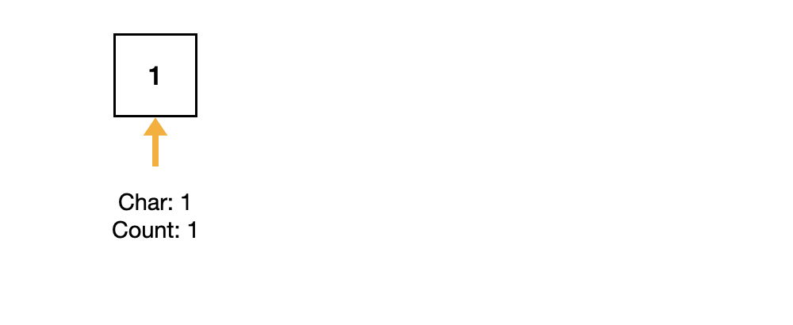

# [38. Count and Say](https://leetcode.com/problems/count-and-say)

The count-and-say sequence is a sequence of digit strings defined by the recursive formula:

countAndSay(1) = "1"

countAndSay(n) is the way you would "say" the digit string from countAndSay(n-1), which is then converted into a different digit string.

To determine how you "say" a digit string, split it into the minimal number of groups so that each group is a contiguous section all of the same character.

Then for each group, say the number of characters, then say the character. To convert the saying into a digit string, replace the counts with a number and

concatenate every saying.

For example, the saying and conversion for digit string "3322251":


Given a positive integer n, return the nth term of the _count-and-say_ sequence.

**Example 1**

```text
Input: n = 1
Output: "1"
Explanation: This is the base case.
```

**Example 2**

```text
Input: n = 4
Output: "1211"
Explanation:
countAndSay(1) = "1"
countAndSay(2) = say "1" = one 1 = "11"
countAndSay(3) = say "11" = two 1's = "21"
countAndSay(4) = say "21" = one 2 + one 1 = "12" + "11" = "1211"
```

**Constraints**

```text
1 <= n <= 30
```

**Related Topics**

```text
1. String
```

## :memo: Note



```cpp
string countPrevious(string s)
```

1. Record the current character.
2. Count the continuous occurrences of it.
3. If the next char != current character, add the count and char to the result string.

```cpp
string countAndSay(int n)
```

1. Use a for loop to call `countPrevious`.
